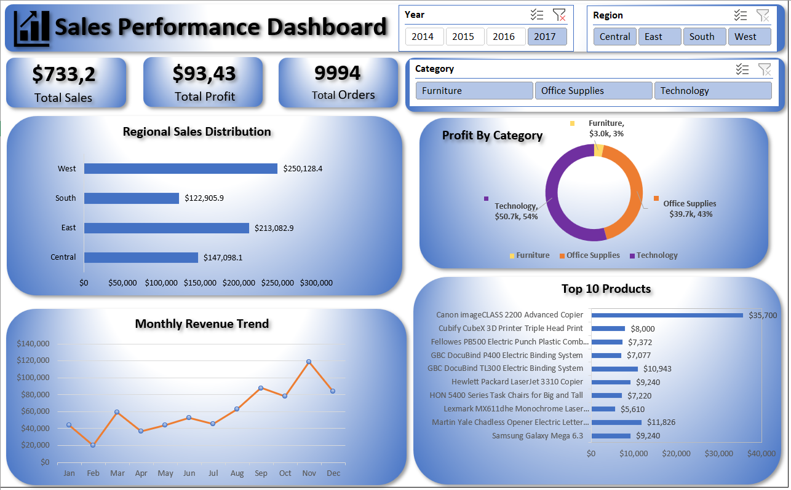

# 📊 Sales Performance Dashboard (Excel Project)

This is my first Data Analytics project built using Microsoft Excel.

## 🔧 Tools Used
- Microsoft Excel
- Pivot Tables
- Pivot Charts
- Slicers
- Data Cleaning
- KPI Metrics

## 📈 Dashboard Features
- Total Sales, Profit, and Orders KPIs
- Regional Sales Analysis
- Category-wise Profit Distribution
- Monthly Sales Trend
- Top 10 Products by Sales
- Interactive Filters (Year, Region, Category)

## ⚠️ Challenges Solved
- Fixed incorrect date formatting
- Converted text values into numeric data
- Connected slicers to multiple pivot tables
- Built dynamic KPI calculations

## 💡 Key Learning
This project helped me understand how Excel can be used as a Business Intelligence tool to create interactive dashboards and generate insights.

## 📷 Dashboard Preview

